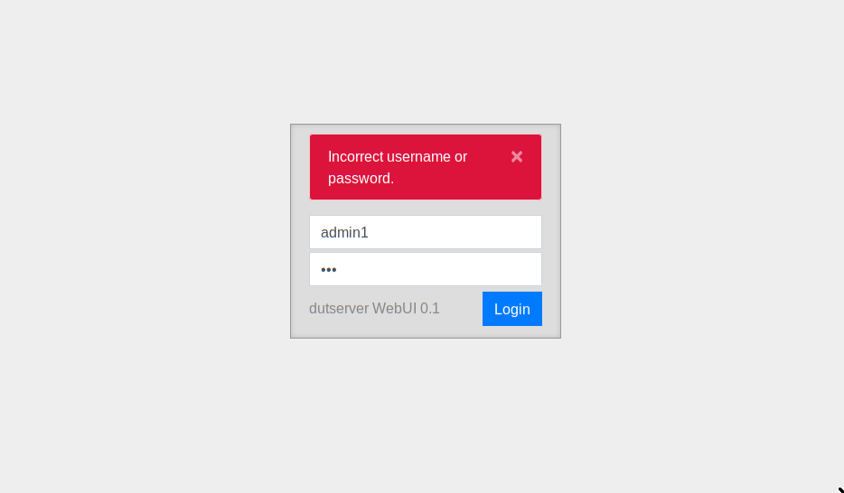
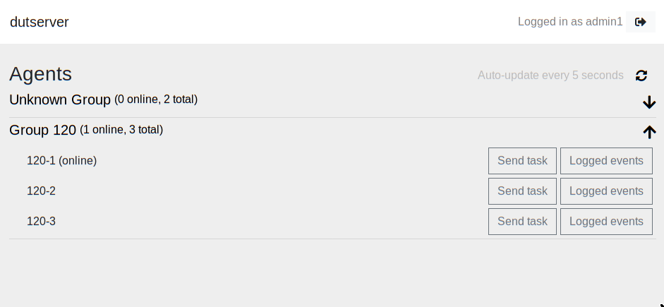
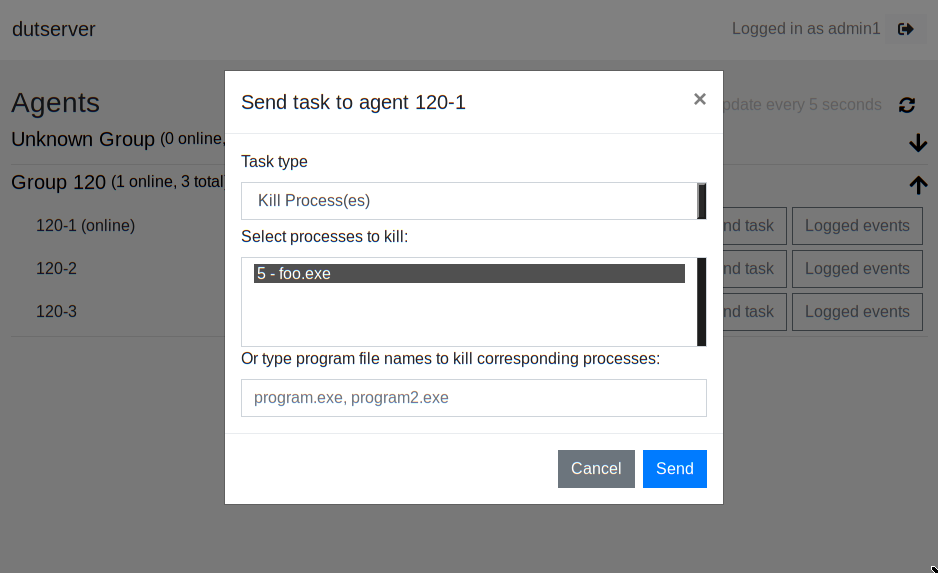

# dutserver WebUI





### Installation

Extract repository contents to place somewhere in your's HTTP server root.
Make sure HTTP API of dutserver is reachable at `api/v1/<endpoint>` (relative
to location of WebUI files).

### Used task types

WebUI sends following task types so agents must understand them.

##### Execute Command

```
{
    "type": "execute_cmd",
    "cmd": "killtask /im hl.exe"
}
```

Expects response in following form:
```
{
    "status_code": 0,
    "output": "command output"
}
```

##### Power Control

Mapped to `shutdown` command (see above).

##### Kill Process

First, WebUI requests list of running processes:
```
{
    "type": "procs_list"
}
```

Expected response structure:
```
{
    "procs": {
        [
            "id": 7,
            "name": "hl.exe",
        ],
        [
            "id": 24,
            "name": "java.exe"
        ],
        [
            "id": 234,
            "name": "chrome.exe"
        ]
    }
}
```

Then goes kill request itself:
```
{
    "type": "kill_procs",
    "procs": [7, "chrome.exe", "nonexistent.exe"]
}
```
`procs` can contain both PIDs and "process names". 

Agent should reply in following form:
```
{
    "killed": [7, "chrome.exe"],
    "failed": ["nonexistent.exe"]
}
```

